# Java-Blogging-App (DevOps Full CI/CD with Jenkins)

[!HINT] This project is a simple java web app that allows users to post their thoughts and blog digitally. Its mostly used to prove that the pipeline is working.

This DevOps project employs a comprehensive CI/CD pipeline to automate the development and deployment process. The architecture emphasizes security, performance, and reliability, integrating industry-leading tools and practices.

## My DevOps Scripting Examples

- My current examples of this project are located here:
  - This included Terraform, Bash scripts and other scripting
  - https://github.com/T-Py-T/devops-install-scripts

## Best Practices Followed

1. **Automation**: The build, test, and deployment process is automated, reducing the risk of human error and speeding up the cycle times. Automation ensures that every code change is tested and validated before deployment.
2. **Security First**: Integrating Aqua Trivy and SonarQube ensures that security vulnerabilities and code quality issues are detected and addressed early in the pipeline, fostering a secure development lifecycle.
3. **Scalability**: Kubernetes provides a scalable infrastructure that can handle fluctuating loads, ensuring consistent performance during peak traffic.
4. **Observability**: Using Grafana and Prometheus allows real-time monitoring, enabling proactive identification and resolution of potential issues before they impact users.
5. **Version Control and Code Review**: GitHub serves as the foundation for collaboration and quality control, ensuring that only well-reviewed, high-quality code reaches production.

## Architecture

The CI/CD pipeline is depicted in the diagram below, which mirrors the "as-built" system, showcasing the tools and workflows utilized.

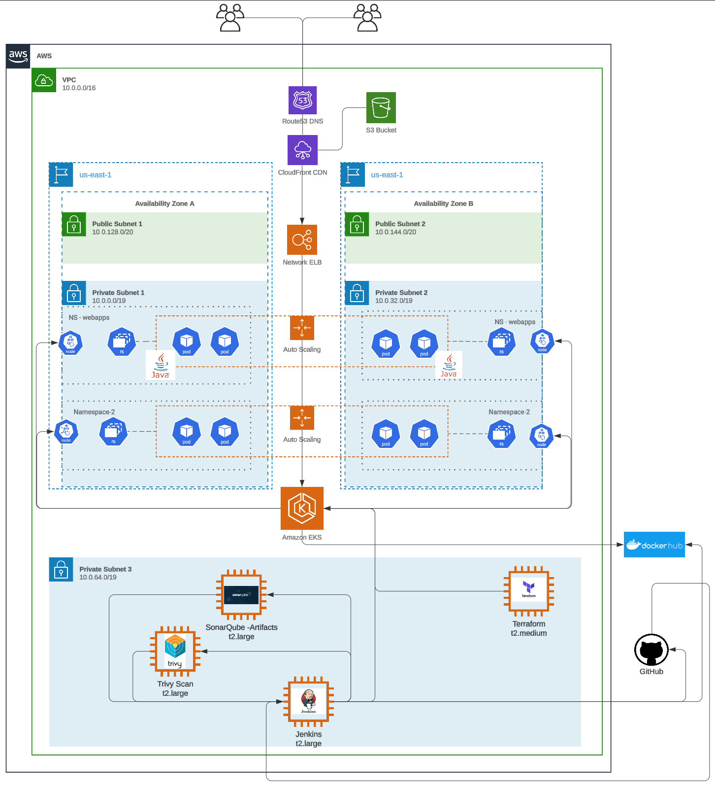

### Key Components

#### A. **Source Code Management**

- **GitHub**: 
  - Serves as the backbone of version control, ensuring seamless collaboration among team members.
  - Pull requests and branch strategies help enforce coding standards and encourage peer reviews.
  - Integrated with Jenkins to trigger automated builds and tests upon code commits, ensuring continuous integration.

#### B. **Build and Test Automation**

- **Jenkins**:
  - Orchestrates the CI/CD pipeline, ensuring that builds, tests, and deployments are fully automated.
  - Integrates with tools like GitHub and Docker to create a streamlined process from code commit to deployment.
  - Provides real-time feedback to developers about build status and test results.

- **Jenkins-TODO**:
  - Relies on external Terraform setup for environment to work
    - When cluster is built API changes
    - Permissions for Jenkins need to be created with cluster (kubectl)
  - Call Terraform in pipeline
    - Allow for tear down of resources after load testing is completed.
    - Pipeline created cluster can be used for load or AB testing.

- **Without Terraform :**
- Kubernetes deployment (apply and get pods) fails
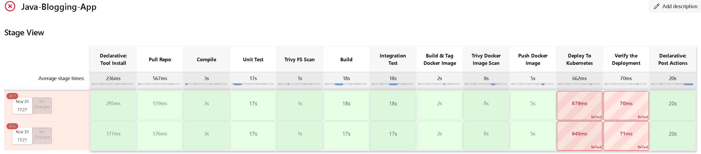
- **With Terraform :**
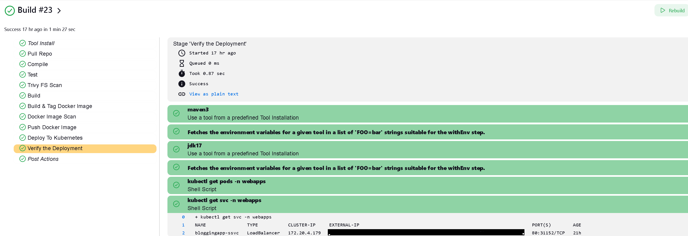

- **Maven**:
  - Simplifies dependency management and builds process for Java projects.
  - Ensures that all dependenciess ns are resolved before building the application, reducing errors and inconsistencies.

- **Nexus Repository Manager**:
  - Acts as a centralized artifact repository, storing and managing Maven dependencies, Docker images, and other build artifacts.
  - Improves build speed by caching dependencies locally, reducing network traffic and build times.
  - Enhances security by providing a controlled, internal source for third-party libraries and internally developed components.

  - **Nexus hosted artifacts**
  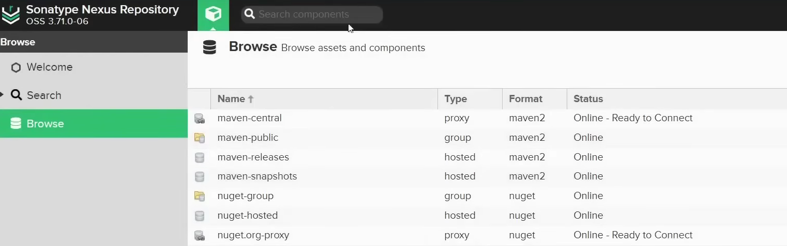
  - **Nexus Artifacts**
  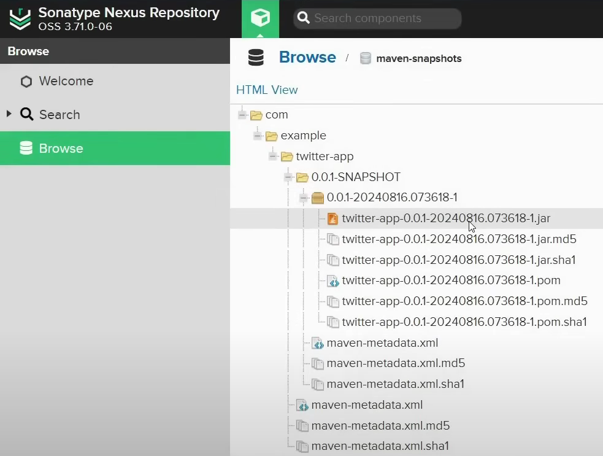
  - **Nexus feedback in Jenkins**
  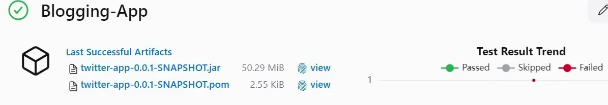


#### C. **Security Scanning**

- **Aqua Trivy**:
  - Scans Docker images and source code for vulnerabilities, ensuring that potential security issues are caught before deployment.
  - Generates detailed reports that can be used to address vulnerabilities promptly.

  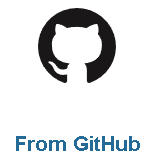

- **SonarQube**:
  - Conducts comprehensive code analysis to identify bugs, code smells, and security vulnerabilities.
  - Provides actionable insights to improve code quality and enforce compliance with coding standards.

  

#### D. **Containerization**

- **Docker**:
  - Packages the Java application into lightweight, portable containers, ensuring consistent environments across development, testing, and production stages.
  - Simplifies deployment by abstracting underlying infrastructure differences.

  *Callout Area*: Showcase Dockerfile and container registry management, explaining how this enables rapid, reliable deployments.

#### E. **Container Orchestration**

- **Elastic Kubernetes Service (EKS)**:
  - Manages the deployment and scaling of containerized applications in a highly available environment.
  - Ensures zero downtime by automatically scaling and redistributing workloads as needed.
  - Namespace configurations (e.g., `webapps` and `namespace 2`) isolate different parts of the system for better organization and security. The second namespace is not currently used, but is planned for a similar python web app
  - The configuration for EKS was update from the **terraform.tf** listed in the linked repo and shown implemented below in a later section.

- **EKS Nodes**
  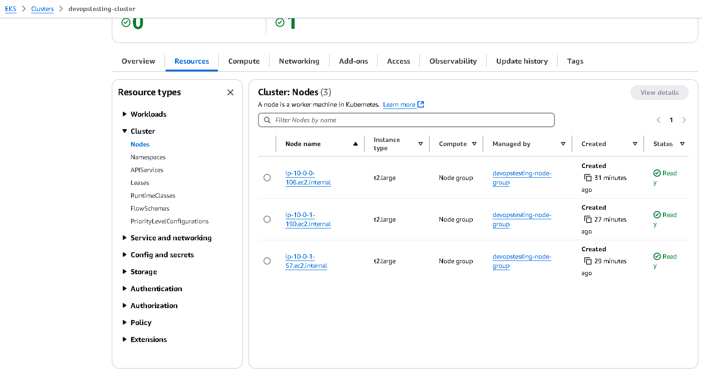

- **EKS CLuster**
  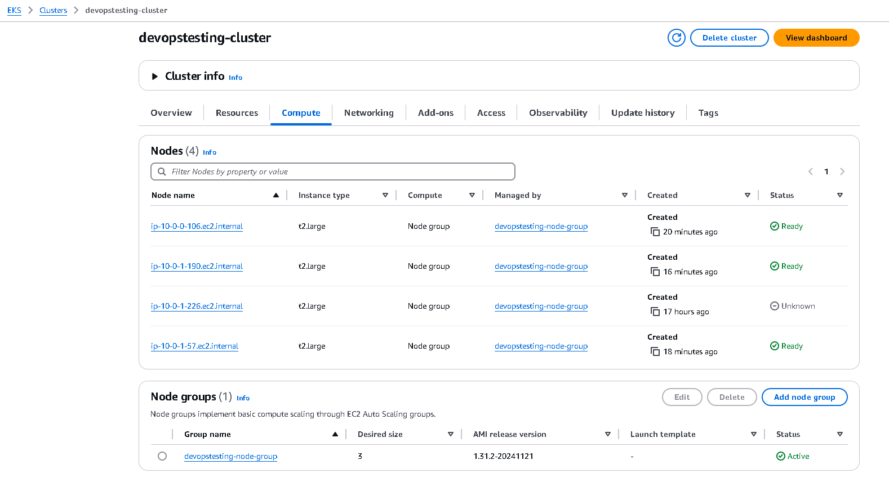

- **EKS Networking**
  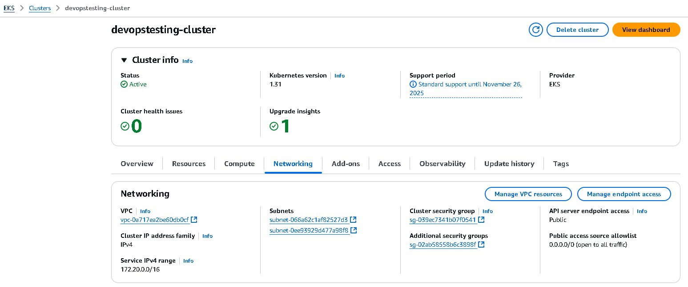

#### F. **Monitoring and Observability**

- **Prometheus**:
  - Collects metrics from various components of the application and infrastructure, providing deep insights into system health and performance.
  - Supports custom queries to detect anomalies and trigger alerts proactively.

  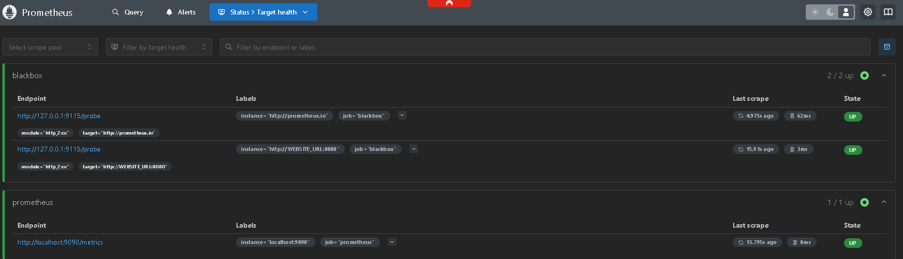

- **Grafana**:
  - Provides user-friendly dashboards for visualizing Prometheus metrics.
  - Enables stakeholders to monitor key performance indicators (KPIs) in real-time, ensuring system reliability.

  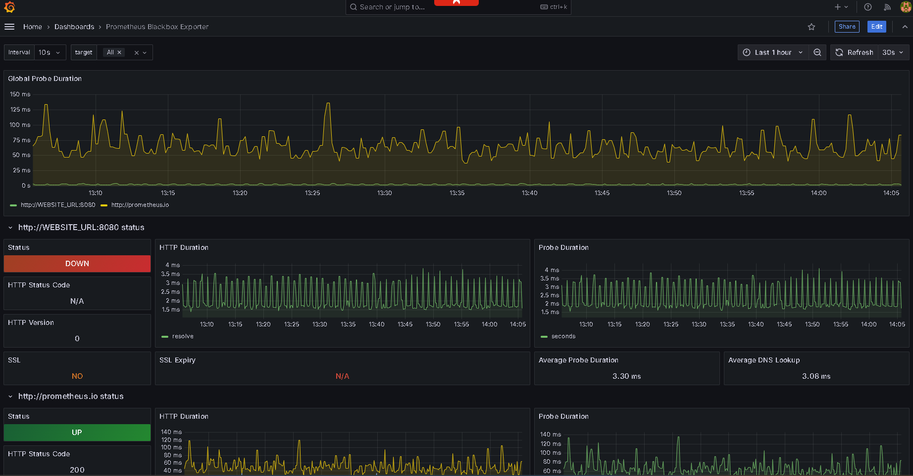

  *Callout Area*: Include snapshots of Grafana dashboards and Prometheus query outputs, demonstrating the observability aspect of the pipeline.

#### G. **Infrastructure as Code (IaC)**

- **Terraform**:
  - Automates the provisioning and management of infrastructure required for the Kubernetes stack that hosts the Java application.
  - Ensures infrastructure consistency and repeatability by defining it as code.
  - The following key AWS resources are provisioned:
    - **VPC**: Creates a virtual private cloud for network isolation.
    - **Subnets**: Two public subnets in `us-east-1a` and `us-east-1b` availability zones.
    - **Internet Gateway**: Provides internet access to the resources within the VPC.
    - **Route Tables and Associations**: Configures routing for the subnets to allow public internet access.
    - **Security Groups**: Defines rules for cluster and node communication, ensuring controlled ingress and egress.
    - **EKS Cluster**: Deploys an Elastic Kubernetes Service cluster for managing the application containers.
    - **EKS Node Group**: Provisions a scalable worker node group with `t2.large` instances to support container workloads.
    - **IAM Roles and Policies**: Configures roles and permissions for both the EKS cluster and node group to interact with AWS services.
  - Facilitates rapid updates and scaling of infrastructure to match application requirements.

``` bash
terraform plan
```


``` bash
terraform apply --auto-approve
```


#### H. **AWS Integration**

- **EC2**: Used to house the servers that control the CI/CD process and handles the actions.
  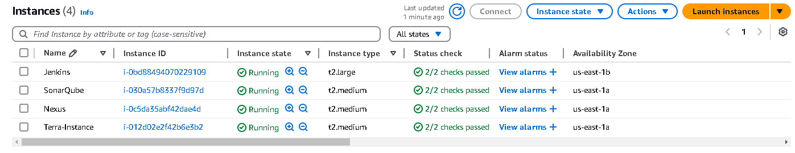

- **VPC**:
  - Ensures a secure and isolated environment for hosting applications and infrastructure.
- **S3 Bucket**:
  - Stores artifacts, logs, and backups, ensuring durability and availability.
- **Route 53**:
  - Manages domain names and routes traffic efficiently to ensure seamless user experiences.
- **CloudFront CDN**:
  - Enhances performance by caching content close to end users.
- **Network Load Balancer**:
  - Distributes incoming traffic to backend services, improving fault tolerance and scalability.
