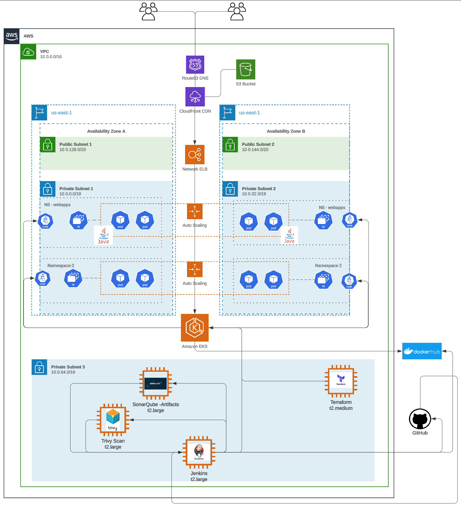
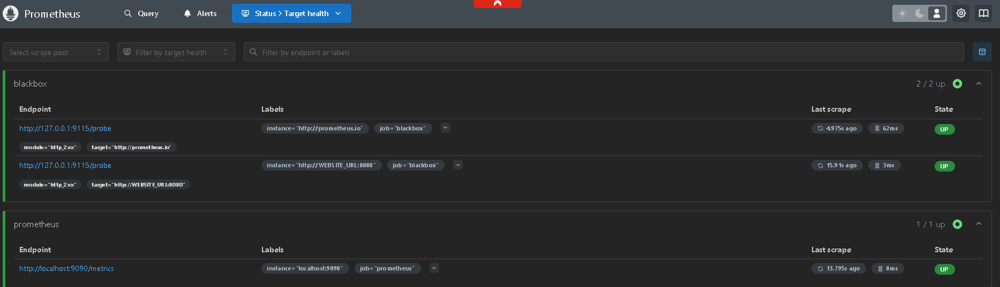
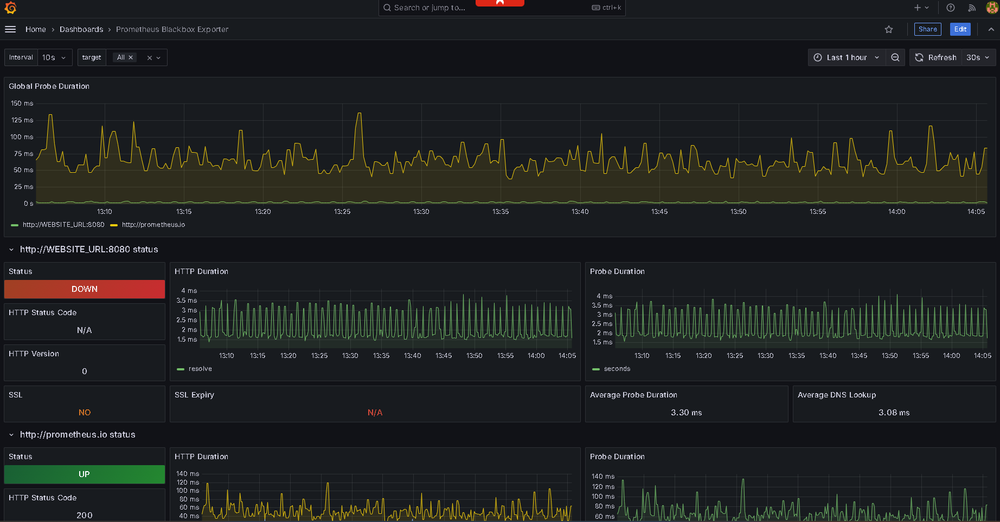

# AWS Devops/Kubernetes microservice CI/CD
This DevOps project employs a comprehensive CI pipeline to automate the development and deployment process. The architecture emphasizes security, performance, and reliability, integrating industry-leading tools and practices.

!!! note "TODO"
    - Merge the AWS docs with the microservices (AKS Readme)
    - Annotate that infra-steps is used to deploy instead of main

<!--
!!! warning "Warning"
    Warning Text

!!! error "Error"
    Error

-->

!!! hint This project is a simple java web app that allows users to post their thoughts and blog digitally. Its mostly used to prove that the pipeline is working.

This DevOps project employs a comprehensive CI/CD pipeline to automate the development and deployment process. The architecture emphasizes security, performance, and reliability, integrating industry-leading tools and practices.

## My DevOps Scripting Examples

- My current examples of this project are located here:
  - This included Terraform, Bash scripts and other scripting
  - [devops-install-scripts](https://github.com/T-Py-T/devops-install-scripts)

## Best Practices Followed

1. **Automation**: The build, test, and deployment process is automated, reducing the risk of human error and speeding up the cycle times. Automation ensures that every code change is tested and validated before deployment.
2. **Security First**: Integrating Aqua Trivy and SonarQube ensures that security vulnerabilities and code quality issues are detected and addressed early in the pipeline, fostering a secure development lifecycle.
3. **Scalability**: Kubernetes provides a scalable infrastructure that can handle fluctuating loads, ensuring consistent performance during peak traffic.
4. **Observability**: Using Grafana and Prometheus allows real-time monitoring, enabling proactive identification and resolution of potential issues before they impact users.
5. **Version Control and Code Review**: GitHub serves as the foundation for collaboration and quality control, ensuring that only well-reviewed, high-quality code reaches production.

## Architecture

The CI/CD pipeline is depicted in the diagram below, which mirrors the "as-built" system, showcasing the tools and workflows utilized.



## Key Components

### A. **Source Code Management**

#### **GitHub:**

- Serves as the backbone of version control, ensuring seamless collaboration among team members.
- Pull requests and branch strategies help enforce coding standards and encourage peer reviews.
- Integrated with Jenkins to trigger automated builds and tests upon code commits, ensuring continuous integration.

### B. **Build and Test Automation**

!!! Note Branch Structure and CI/CD Workflow

    This repo is unique in that we are able to allow each of the microservices written in different languages to run their independant Jenkins file corresponding to that language.

    Each microservice in this project has its own branch in the repository. This ensures that changes to one service do not affect others and allows for independent development and deployment.

#### **Branches**

- `adservice`: Contains the code and Jenkinsfile for the `adservice` service.
- `cartservice`: Contains the code and Jenkinsfile for the `cartservice` service.
- `checkoutservice`: Contains the code and Jenkinsfile for the `checkoutservice` service.
- `currencyservice`: Contains the code and Jenkinsfile for the `currencyservice` service.
- `emailservice`: Contains the code and Jenkinsfile for the `emailservice` service.
- `frontend`: Contains the code and Jenkinsfile for the `frontend` service.
- `infra-steps`: Contains the  deployment.yaml and Jenkinsfile. This is where we can run updates for ArgoCD to identify changes the deployment (image tag/version)
- `loadgenerator`: Contains the code and Jenkinsfile for the `loadgenerator` service.
- `paymentservice`: Contains the code and Jenkinsfile for the `paymentservice` service.
- `productcatalogservice`: Contains the code and Jenkinsfile for the `productcatalogservice` service.
- `recommendationservice`: Contains the code and Jenkinsfile for the `recommendationservice` service.
- `shippingservice`: Contains the code and Jenkinsfile for the `shippingservice` service.

#### Example Jenkinsfile

Each branch has a `Jenkinsfile` that defines the CI/CD pipeline for that specific service. This allows language specific testing automation pipelines.

Below is an example of what the adservice Jenkinsfile looks like (Java app):

```groovy

pipeline {
    agent any
    environment {
        MAJOR_VERSION = '1'
        DOCKERHUB_REPO = '{DOCKERHUB-REPO}'
        GIT_REPO_URL = '{REPO-URL}'
        VERSION_TAG = "${MAJOR_VERSION}.${BUILD_NUMBER}"
        DOCKER_IMAGE = "${DOCKERHUB_REPO}/adservice:${VERSION_TAG}"
    }
    tools {
        gradle 'gradle8'
        jdk 'jdk19'
    }
    stages {
        // Clean the workspace
        stage('Clean Repo') {steps {deleteDir()}}
        stage('Pull Repo') { 
            steps { 
                withCredentials([usernamePassword(credentialsId: 'git-cred', usernameVariable: 'GIT_USERNAME', passwordVariable: 'GIT_PASSWORD')]) {
                    git branch: 'adservice', url: "https://${GIT_USERNAME}:${GIT_PASSWORD}@${env.GIT_REPO_URL.replace('https://', '')}"
                }}}
        stage('Gradle Compile') { 
            steps {  
                sh "chmod +x ./gradlew"
                sh "./gradlew compileJava" 
            }}
        // stage('Format Code') {steps {sh "./gradlew googleJavaFormat"}} // FORMATTING NOT WORKING (GOOGLE FORMAT FAILS)
        stage('Gradle Build') {steps {sh "./gradlew build"}}
        // stage('Gradle Test') {steps {sh "./gradlew test"}} // There are no tests in the java branch currently 
        stage('Trivy FS Scan') {steps {sh "trivy fs --format table -o fs.html ." }}       
        stage('Build & Tag Docker Image') { 
            steps {script { 
                withDockerRegistry(credentialsId: 'docker-cred', toolName: 'docker') {
                    sh "docker build -t ${env.DOCKER_IMAGE} ."
                }}}}
        stage('Docker Image Scan') { 
            steps {script {
                sh "trivy image --format table -o trivy-image-report.html ${env.DOCKER_IMAGE}" 
                }}}       
        stage('Push Docker Image') {
            steps { 
                script {
                    withDockerRegistry(credentialsId: 'docker-cred', toolName: 'docker') {
                        sh "docker push ${env.DOCKER_IMAGE}" 
                }}}}
        stage('Clean Workspace') {steps {deleteDir()}}
        stage('Pull Infra-Steps Repo') { 
            steps { 
                withCredentials([usernamePassword(credentialsId: 'git-cred', usernameVariable: 'GIT_USERNAME', passwordVariable: 'GIT_PASSWORD')]) {
                    git branch: 'Infra-Steps', url: "https://${GIT_USERNAME}:${GIT_PASSWORD}@${env.GIT_REPO_URL.replace('https://', '')}"
                }}}
        stage('Update and Commit Deployment YAML') {
            steps {
                withCredentials([usernamePassword(credentialsId: 'git-cred', usernameVariable: 'GIT_USERNAME', passwordVariable: 'GIT_PASSWORD')]) {
                    script {
                        sh """
                            sed -i 's|image: ${env.DOCKERHUB_REPO}/adservice:.*|image: ${env.DOCKER_IMAGE} |' deployment-service.yml
                            git add deployment-service.yml
                            git commit -m "Update Docker image to ${env.DOCKER_IMAGE}" || echo "No changes to commit"
                            git push https://${GIT_USERNAME}:${GIT_PASSWORD}@${env.GIT_REPO_URL.replace('https://', '')} Infra-Steps
                        """
                    }}}}
        stage('Create Pull Request') {
            steps {
                withCredentials([usernamePassword(credentialsId: 'git-cred', usernameVariable: 'GIT_USERNAME', passwordVariable: 'GIT_PASSWORD')]) {
                    sh """
                        gh auth login --with-token <<< "${GIT_PASSWORD}"
                        gh pr create --title "Update Docker image to ${env.DOCKERHUB_REPO}/adservice:${env.VERSION_TAG}" --body "This PR updates the Docker image to ${env.DOCKER_IMAGE}" --base main --head Infra-Steps
                    """
                }}}
    }
}
```

!!! Note Jenkins - #FUTURE-TODO
    - Relies on external Terraform setup for environment to work
    - Call Terraform in pipeline
        - Allow for tear down of resources after load testing is completed.
        - Pipeline created cluster can be used for load or AB testing.

- **Jenkins**:
  - Orchestrates the CI/CD pipeline, ensuring that builds, tests, and deployments are fully automated.
  - Integrates with tools like GitHub, Docker, Trivy, SonarQube, Kubernetes to create a streamlined process from code commit to deployment.
  - Provides real-time feedback to developers/devops teams about build status and test results.

  

  **Example Application Pipeline**
  Here is an example of the above Jenkinsfile for the adservice microservice (Java) running after a merge
  

  **Example CD Pipeline**
  Here is an example of the above Jenkinsfile for the Infr-Steps running after a successful build since the image on the deployment-service.yml is modified. This triggers build of this branch which applies the changes to the kubernetes cluster.
  **NOTE** - This runs every time the branch is updated with a PR (auto complete after YAML linting)
  

#### C. **Security Scanning**

- **Aqua Trivy**:
  - Scans Docker images and source code for vulnerabilities, ensuring that potential security issues are caught before deployment.
  - Generates detailed reports that can be used to address vulnerabilities promptly.
  

#### D. **Containerization**

- **Docker**:
  - Packages the application into lightweight, portable containers, ensuring consistent environments across development, testing, and production stages.
  - Simplifies deployment by abstracting underlying infrastructure differences.

#### E. **Container Orchestration**

- **Elastic Kubernetes Service (EKS)**:
  - Manages the deployment and scaling of containerized applications in a highly available environment.
  - Ensures zero downtime by automatically scaling and redistributing workloads as needed.
  - Namespace configurations (e.g., `webapps` and `namespace 2`) isolate different parts of the system for better organization and security. The second namespace is not currently used, but is planned for a similar python web app
  - The configuration for EKS was update from the terraform **main.tf** listed in the [devops-install-scripts](https://github.com/T-Py-T/devops-install-scripts) repo and shown implemented below in a later section.

- **EKS Nodes**
  

- **EKS CLuster**
  

- **EKS Networking**
  

#### F. **Monitoring and Observability**

- **Prometheus**:
  - Collects metrics from various components of the application and infrastructure, providing deep insights into system health and performance.
  - Supports custom queries to detect anomalies and trigger alerts proactively.

  

- **Grafana**:
  - Provides user-friendly dashboards for visualizing Prometheus metrics.
  - Enables stakeholders to monitor key performance indicators (KPIs) in real-time, ensuring system reliability.

  

#### G. **Infrastructure as Code (IaC)**

- **Terraform**:
  - Automates the provisioning and management of infrastructure required for the Kubernetes stack that hosts the Java application.
  - Ensures infrastructure consistency and repeatability by defining it as code.
  - The following key AWS resources are provisioned:
    - **VPC**: Creates a virtual private cloud for network isolation.
    - **Subnets**: Two public subnets in `us-east-1a` and `us-east-1b` availability zones.
    - **Internet Gateway**: Provides internet access to the resources within the VPC.
    - **Route Tables and Associations**: Configures routing for the subnets to allow public internet access.
    - **Security Groups**: Defines rules for cluster and node communication, ensuring controlled ingress and egress.
    - **EKS Cluster**: Deploys an Elastic Kubernetes Service cluster for managing the application containers.
    - **EKS Node Group**: Provisions a scalable worker node group with `t2.large` instances to support container workloads.
    - **IAM Roles and Policies**: Configures roles and permissions for both the EKS cluster and node group to interact with AWS services.
  - Facilitates rapid updates and scaling of infrastructure to match application requirements.

##### Terraform Examples

Commands used with the main.tf to deploy the EKS infrastructure

``` bash 
terraform plan 
```


```bash
    terraform apply --auto-approve
```


#### H. **AWS Integration**

- **EC2**:
  - Used to house the servers that control the CI/CD process and handles the actions
  - ECS also uses the EC2 instances for scaling the EKS cluster
- **VPC**:
  - Ensures a secure and isolated environment for hosting applications and infrastructure.
- **S3 Bucket**:
  - Stores artifacts, logs, and backups, ensuring durability and availability.
- **Route 53**:
  - Manages domain names and routes traffic efficiently to ensure seamless user experiences.
- **CloudFront CDN**:
  - Enhances performance by caching content close to end users.
- **Network Load Balancer**:
  - Distributes incoming traffic to backend services, improving fault tolerance and scalability.
