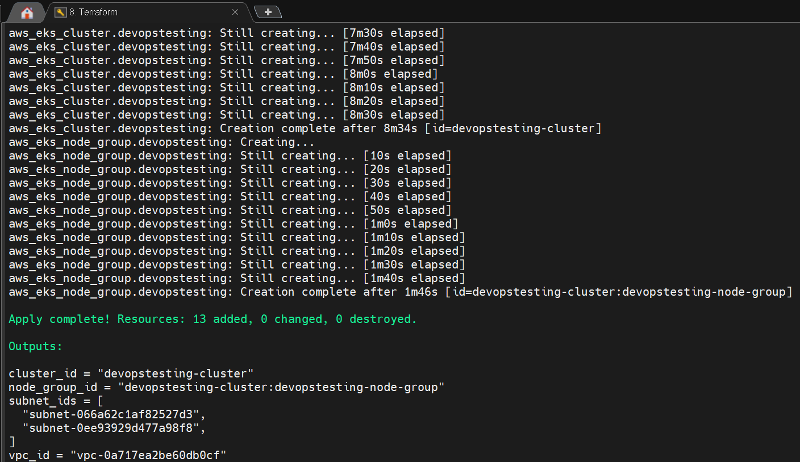

# AWS Devops/Kubernetes microservice CI/CD

-This project is using an example microservices demo (Google Cloud) with the link shown below.

> **My DevOps Scripting Examples**
    - Re-usable examples Terraform, Bash scripts and other scripting
      - https://github.com/T-Py-T/devops-install-scripts

## Application overview

[Online Boutique](https://github.com/GoogleCloudPlatform/microservices-demo) is a cloud-first microservices demo application consisting of 11 microservices applications. The application is a web-based e-commerce app where users can browse items, add them to the cart, and purchase them.

!!! Note Branch Structure and CI/CD Workflow

    This repo is unique in that we are able to allow each of the microservices written in different languages to have **own branch** in the repository..

    Each microservice in this project has its own **Independant Jenkins** file corresponding to that language. This ensures that changes to one service do not affect others and allows for independent development and deployment.

### Application Architecture

Each of the 11 microservices written in different languages that talk to each other over gRPC.

[](/docs/img/architecture-diagram.png)

Find **Protocol Buffers Descriptions** at the [`./protos` directory](/protos).

| Service | Language |   Description     |
| -------| --------| -------- |
| [frontend](/src/frontend) | Go    | Exposes an HTTP server to serve the website. Does not require signup/login and generates session IDs for all users automatically. |
| [cartservice](/src/cartservice) | C#  | Stores the items in the user's shopping cart in Redis and retrieves it.   |
| [productcatalogservice](/src/productcatalogservice) | Go   | Provides the list of products from a JSON file and ability to search products and get individual products.  |
| [currencyservice](/src/currencyservice) | Node.js   | Converts one money amount to another currency. Uses real values fetched from European Central Bank. It's the highest QPS service. |
| [paymentservice](/src/paymentservice)  | Node.js       | Charges the given credit card info (mock) with the given amount and returns a transaction ID.                                     |
| [shippingservice](/src/shippingservice)             | Go            | Gives shipping cost estimates based on the shopping cart. Ships items to the given address (mock)                                 |
| [emailservice](/src/emailservice)                   | Python        | Sends users an order confirmation email (mock).                                                                                   |
| [checkoutservice](/src/checkoutservice)             | Go            | Retrieves user cart, prepares order and orchestrates the payment, shipping and the email notification.                            |
| [recommendationservice](/src/recommendationservice) | Python        | Recommends other products based on what's given in the cart.                                                                      |
| [adservice](/src/adservice)                         | Java          | Provides text ads based on given context words.                                                                                   |
| [loadgenerator](/src/loadgenerator)                 | Python/Locust | Continuously sends requests imitating realistic user shopping flows to the frontend.     |

### Screenshots

| Home Page | Checkout Screen |
| ------- | ----- |
| [](/docs/img/online-boutique-frontend-1.png) | [](/docs/img/online-boutique-frontend-2.png) |

## Features

- **[Kubernetes](https://kubernetes.io)/[EKS]():**
  The app is designed to run on Kubernetes (both locally on "Docker for Desktop", as well as on the cloud with EKS).
- **[gRPC](https://grpc.io):** Microservices use a high volume of gRPC calls to communicate to each other.
- **Synthetic Load Generation:** The application demo comes with a background job that creates realistic usage patterns on the website using [Locust](https://locust.io/) load generator.

<!-- 
**************** TODO SECTION 

> # Note: This is a reminder to come back and update this section.
- [ ] Add screenshots of monitoring dashboards
- [ ] Add ArgoCD Images/Section
- [ ] Terraform Section?
- [ ] Prometheus Section? 

Markdown examples
!!! note "TODO"
    - Merge the AWS docs with the microservices (AKS Readme)
    - Annotate that infra-steps is used to deploy instead of main

!!! warning "Warning"
    Warning Text

!!! error "Error"
    Error
-->


## Best Practices Followed

### DevOps

- **Automation**: The build, test, and deployment process is automated, reducing the risk of human error and speeding up the cycle times. Automation ensures that every code change is tested and validated before deployment.
- **Security First**: Integrating Aqua Trivy ensures that security vulnerabilities and code quality issues are detected and addressed early in the pipeline, fostering a secure development lifecycle.
- **Scalability**: Kubernetes provides a scalable infrastructure that can handle fluctuating loads, ensuring consistent performance during peak traffic.
- **Version Control and Code Review**: Azure Repos serves as the foundation for collaboration and quality control, ensuring that only well-reviewed, high-quality code reaches production.
<!-- - **Observability**: Using istio allows real-time monitoring, enabling proactive identification and resolution of potential issues before they impact users.
- **GitOps with ArgoCD**: Using the repo monitoring of ArgoCD, we are able to detect changes in the mainfest of the repository and sync the changes into the Kubernetes environment. -->

### DevSecOps

- **Secrets Management**: Docker credentials are stored securely using Jenkins server.
- **Static Analysis**: Trivy is used for static analysis.
- **Build and Push Images**: Docker images are built and pushed to Docker Hub.
- **Image Scanning**: Docker images are pulled and scanned for vulnerabilities using Trivy.
- **Pull and Test Images**: Docker images are pulled and tested.

## Architecture

The CI/CD pipeline is depicted in the diagram below, which mirrors the "as-built" system, showcasing the tools and workflows utilized.


## Key Components

### A. **Source Code Management**

#### **GitHub:**

- Serves as the backbone of version control, ensuring seamless collaboration among team members.
- Pull requests and branch strategies help enforce coding standards and encourage peer reviews.
- Integrated with Jenkins to trigger automated builds and tests upon code commits, ensuring continuous integration.

### B. **Build and Test Automation**

#### **Branches**

- `adservice`: Contains the code **(Java)** and Jenkinsfile for the `adservice` service.
- `cartservice`: Contains the code **(C#)** and Jenkinsfile for the `cartservice` service.
- `checkoutservice`: Contains the code **(Go)** and Jenkinsfile for the `checkoutservice` service.
- `currencyservice`: Contains the code **(NodeJS)** and Jenkinsfile for the `currencyservice` service.
- `emailservice`: Contains the code **(Python)** and Jenkinsfile for the `emailservice` service.
- `frontend`: Contains the code **(Go)** and Jenkinsfile for the `frontend` service.
- `infra-steps`: Contains the deploymentservices.yaml and Jenkinsfile. This branch is used to contain changes the deployment (image tag/version) and sync the versions into kubernetes clusters.
- `loadgenerator`: Contains the code **(Python)** and Jenkinsfile for the `loadgenerator` service.
- `paymentservice`: Contains the code **(NodeJS)** and Jenkinsfile for the `paymentservice` service.
- `productcatalogservice`: Contains the code **(Go)** and Jenkinsfile for the `productcatalogservice` service.
- `recommendationservice`: Contains the code **(Python)** and Jenkinsfile for the `recommendationservice` service.
- `shippingservice`: Contains the code **(Go)** and Jenkinsfile for the `shippingservice` service.

#### Example Jenkinsfile

Each branch has a `Jenkinsfile` that defines the CI/CD pipeline for that specific service. This allows language specific testing automation pipelines.

Below is an example of what the adservice Jenkinsfile looks like (Java app):

```groovy

pipeline {
    agent any

    environment {
        MAJOR_VERSION = '1'
        DOCKERHUB_REPO = 'tnt850910'
        BRANCH = 'adservice'
        GIT_REPO_URL = 'https://github.com/T-Py-T/eks-jenkins-microservices-cicd'
        VERSION_TAG = "${MAJOR_VERSION}.${BUILD_NUMBER}"
        DOCKER_IMAGE = "${DOCKERHUB_REPO}/${BRANCH}:${VERSION_TAG}"
    }
    tools {
        gradle 'gradle8'
        jdk 'jdk19'
    }
    stages {
        // Clean the workspace
        stage('Clean Repo') {steps {deleteDir()}}
        stage('Pull Repo') { steps { withCredentials(
            [usernamePassword(credentialsId: 'git-cred', usernameVariable: 'GIT_USERNAME', passwordVariable: 'GIT_PASSWORD')]) {
            git branch: "${env.BRANCH}", url: "https://${GIT_USERNAME}:${GIT_PASSWORD}@${env.GIT_REPO_URL.replace('https://', '')}"
        }}}
        stage('Trivy FS Scan') {
            steps {
                script {
                    def trivyOutput = sh(script: "trivy fs --severity HIGH,CRITICAL --format table .", returnStdout: true).trim()
                    println trivyOutput // Display Trivy scan results
                    if (trivyOutput.contains("Total: 0")) { echo "No vulnerabilities found in the Docker image."}
                    else { echo "Vulnerabilities found in the Docker image." }
                }}}
        stage('Gradle Compile') { 
            steps {  
                sh "chmod +x ./gradlew"
                sh "./gradlew compileJava" 
            }}
        // stage('Format Code') {steps {sh "./gradlew googleJavaFormat"}} // FORMATTING NOT WORKING (GOOGLE FORMAT FAILS)
        stage('Gradle Build') {steps {sh "./gradlew build"}}
        stage('Gradle Test') {steps {sh "./gradlew test"}} // There are no tests in the java branch currently 
        stage('Build & Tag Docker Image') { 
            steps {script { 
                withDockerRegistry(credentialsId: 'docker-cred', toolName: 'docker') {
                    sh "echo DOCKER_IMAGE: ${env.DOCKER_IMAGE} "
                    sh "docker build -t ${env.DOCKER_IMAGE} ."
                }}}}
        stage('Trivy Image Scan') {
            steps {
                script {
                    def trivyOutput = sh(script: "trivy image --severity HIGH,CRITICAL --format table ${env.DOCKER_IMAGE}", returnStdout: true).trim()
                    println trivyOutput // Display Trivy scan results
                    if (trivyOutput.contains("Total: 0")) { echo "No vulnerabilities found in the Docker image."}
                    else { echo "Vulnerabilities found in the Docker image." }
                }}}
        stage('Push Docker Image') {
            steps { 
                script {
                    withDockerRegistry(credentialsId: 'docker-cred', toolName: 'docker') {
                        sh "docker push ${env.DOCKER_IMAGE}"
                }}}}
        stage('Clean Workspace') {steps {deleteDir()}}
        stage('Pull Infra-Steps Repo') { 
            steps { 
                withCredentials([usernamePassword(credentialsId: 'git-cred', usernameVariable: 'GIT_USERNAME', passwordVariable: 'GIT_PASSWORD')]) {
                    git branch: 'Infra-Steps', url: "https://${GIT_USERNAME}:${GIT_PASSWORD}@${env.GIT_REPO_URL.replace('https://', '')}"
                }}}
        stage('Update and Commit Deployment YAML') {
            steps {
                withCredentials([usernamePassword(credentialsId: 'git-cred', usernameVariable: 'GIT_USERNAME', passwordVariable: 'GIT_PASSWORD')]) {
                    script {
                        sh """
                            sed -i 's|image: ${env.DOCKERHUB_REPO}/adservice:.*|image: ${env.DOCKER_IMAGE} |' deployment-service.yml
                            git add deployment-service.yml
                            git commit -m "Update Docker image to ${env.DOCKER_IMAGE}" || echo "No changes to commit"
                            git push https://${GIT_USERNAME}:${GIT_PASSWORD}@${env.GIT_REPO_URL.replace('https://', '')} Infra-Steps
                        """
                    }}}}
    }
}
```

!!! Note Jenkins - #FUTURE-TODO
    - Relies on external Terraform setup for environment to work
    - Call Terraform in pipeline
        - Allow for tear down of resources after load testing is completed.
        - Pipeline created cluster can be used for load or AB testing.

- **Jenkins**:
  - Orchestrates the CI/CD pipeline, ensuring that builds, tests, and deployments are fully automated.
  - Integrates with tools like GitHub, Docker, Trivy, SonarQube, Kubernetes to create a streamlined process from code commit to deployment.
  - Provides real-time feedback to developers/devops teams about build status and test results.

  

  **Example Application Pipeline**
  Here is an example of the above Jenkinsfile for the adservice microservice (Java) running after a merge
  

  **Example CD Pipeline**
  Here is an example of the above Jenkinsfile for the Infr-Steps running after a successful build since the image on the deployment-service.yml is modified. This triggers build of this branch which applies the changes to the kubernetes cluster.
  **NOTE** - This runs every time the branch is updated with a PR (auto complete after YAML linting)
  

#### C. **Security Scanning**

- **Aqua Trivy**:
  - Scans Docker images and source code for vulnerabilities, ensuring that potential security issues are caught before deployment.
  - Generates detailed reports that can be used to address vulnerabilities promptly.
  

#### D. **Containerization**

- **Docker**:
  - Packages the application into lightweight, portable containers, ensuring consistent environments across development, testing, and production stages.
  - Simplifies deployment by abstracting underlying infrastructure differences.

#### E. **Container Orchestration**

- **Elastic Kubernetes Service (EKS)**:
  - Manages the deployment and scaling of containerized applications in a highly available environment.
  - Ensures zero downtime by automatically scaling and redistributing workloads as needed.
  - Namespace configurations (e.g., `webapps` and `namespace 2`) isolate different parts of the system for better organization and security. The second namespace is not currently used, but is planned for a similar python web app
  - The configuration for EKS was update from the terraform **main.tf** listed in the [devops-install-scripts](https://github.com/T-Py-T/devops-install-scripts) repo and shown implemented below in a later section.

- **EKS Nodes**
  

- **EKS CLuster**
  

- **EKS Networking**
  

<!-- REMOVE WHEN ARGO IS WORKING
#### F. **GtiOps with ArgoCD**

- **Argo Dashboard**
  

- **Argo Sync**
  

- **Argo Updates**
  

- **Argo Rollback**
  
-->

<!-- REMOVE WHEN Monitoring IS WORKING
#### F. **Monitoring and Observability**

- **Prometheus**:
  - Collects metrics from various components of the application and infrastructure, providing deep insights into system health and performance.
  - Supports custom queries to detect anomalies and trigger alerts proactively.
  

- **Grafana**:
  - Provides user-friendly dashboards for visualizing Prometheus metrics.
  - Enables stakeholders to monitor key performance indicators (KPIs) in real-time, ensuring system reliability.
  

  *Callout Area*: Include snapshots of Grafana dashboards and Prometheus query outputs, demonstrating the observability aspect of the pipeline.
-->

#### F. **Infrastructure as Code (IaC)**

- **Terraform**:
  - Automates the provisioning and management of infrastructure required for the Kubernetes stack that hosts the Java application.
  - Ensures infrastructure consistency and repeatability by defining it as code.
  - The following key AWS resources are provisioned:
    - **VPC**: Creates a virtual private cloud for network isolation.
    - **Subnets**: Two public subnets in `us-east-1a` and `us-east-1b` availability zones.
    - **Internet Gateway**: Provides internet access to the resources within the VPC.
    - **Route Tables and Associations**: Configures routing for the subnets to allow public internet access.
    - **Security Groups**: Defines rules for cluster and node communication, ensuring controlled ingress and egress.
    - **EKS Cluster**: Deploys an Elastic Kubernetes Service cluster for managing the application containers.
    - **EKS Node Group**: Provisions a scalable worker node group with `t2.large` instances to support container workloads.
    - **IAM Roles and Policies**: Configures roles and permissions for both the EKS cluster and node group to interact with AWS services.
  - Facilitates rapid updates and scaling of infrastructure to match application requirements.

##### Terraform Examples

Commands used with the `main.tf` to deploy the EKS infrastructure

``` bash 
terraform plan 
```


```bash
    terraform apply --auto-approve
```



#### G. **AWS Integration**

- **EC2**:
  - Used to house the servers that control the CI/CD process and handles the actions
  - ECS also uses the EC2 instances for scaling the EKS cluster
- **VPC**:
  - Ensures a secure and isolated environment for hosting applications and infrastructure.
- **S3 Bucket**:
  - Stores artifacts, logs, and backups, ensuring durability and availability.
- **Route 53**:
  - Manages domain names and routes traffic efficiently to ensure seamless user experiences.
- **CloudFront CDN**:
  - Enhances performance by caching content close to end users.
- **Network Load Balancer**:
  - Distributes incoming traffic to backend services, improving fault tolerance and scalability.
